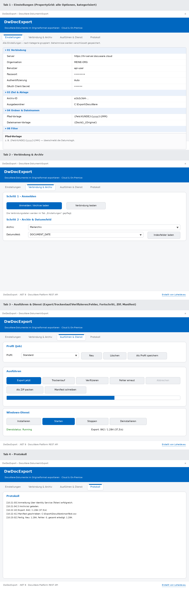

<div align="center">

# 📤 DwDocExport

**Exportiert Dokumente aus DocuWare im Originalformat – Cloud & On-Premise, GUI & Windows-Dienst.**

[](https://dotnet.microsoft.com/)
[](#-systemvoraussetzungen)
[](https://developer.docuware.com/rest/index.html)
[](#-lizenz)

</div>

---

**DwDocExport** holt **alle Dokumente** eines DocuWare-Archivs über die
offizielle **Platform REST API** heraus – und zwar **im Originalformat** und für
**jeden Dateityp** (PDF, MSG, EML, DOCX, XLSX, JPG, ZIP …). Der Download nutzt
`targetFileType=Auto`, sodass DocuWare die Originaldatei liefert; der Dateiname
kommt aus dem `Content-Disposition`-Header.

> 💡 **Nichts ist auf E-Mails fest verdrahtet.** Der erste Anwendungsfall ist ein
> **Mailarchiv (EML/MSG)**, aber das Tool funktioniert mit jedem Archiv und jedem
> Dateityp.

---

## ✨ Features

**Kern**
- 🗂️ **Vollständiger Export** eines Archivs im **Originalformat**, dateityp-neutral
- ☁️🏢 **Cloud *und* On-Premise** – Token-Login (Identity Service), **App-Registrierung** (Client-Credentials) **und** klassischer Cookie-Login, `AuthMode=Auto`
- 🖥️ **Eine EXE, zwei Modi**: moderne **GUI** (Tabs, PropertyGrid, Dunkelmodus) + robuster **Windows-Dienst**
- 🛡️ **Passwort & alle Secrets verschlüsselt** in der config.json (Windows DPAPI)

**Gezielt exportieren**
- 🔎 **Filter**: Datumsbereich und beliebige **Indexfeld-Bedingungen** (=, ≠, enthält, beginnt mit)
- 🧩 **Pfad- & Dateinamen-Vorlagen** mit Platzhaltern: `{Feld:KUNDE}\{yyyy}\{MM}\{DocId}_{Feld:BELEGNR}`
- 🗃️ **Mehrere Profile/Jobs** – mehrere Archive mit eigener Konfiguration, der Dienst arbeitet alle ab
- 🎛️ **Download-Optionen**: Zielformat (Auto/PDF/…), Annotationen, pro Sektion, Datei-Datum aus Indexfeld

**Interaktiv & sicher**
- ▶️ **Direkt aus der GUI**: Export jetzt · **Trockenlauf** · **Verifizieren** · **Fehler erneut** – mit **Fortschrittsbalken, Durchsatz & Abbrechen**
- 🔐 **Integrität**: **SHA-256** je Datei, **CSV-Manifest**, Verifikationslauf (Datei + Prüfsumme)
- 🗜️ **ZIP-Paketierung** (gesamt oder je Jahr/Monat), 🧾 **Metadaten-Sidecar** je Dokument
- ✉️ **Benachrichtigungen** per **SMTP-Mail** und **Webhook** (Teams/Slack)

**Robust & betriebstauglich**
- 🚀 **Parallele Downloads** + **Bandbreitenbremse**; 🔁 fortsetzbar, ohne Doppel-Downloads (SQLite/WAL)
- 🧱 **Atomare, gestreamte Schreibvorgänge**; **lange Pfade** (>260) unterstützt
- ♻️ **Retry mit Backoff** (respektiert `Retry-After`), Auto-Reauth bei `401`, **HATEOAS-`next`-Paging**
- ⏱️ **Zeitplan** (aktives Zeitfenster) + **periodisches/inkrementelles Nachscannen**
- 🌐 **Proxy/TLS**-Optionen (eigenes CA-Zertifikat, Bypass für Testsysteme), **Dienst-Konto** (gMSA) bei Installation
- 📝 **Logging** ins EventLog **und** in eine rotierende Logdatei (einstellbares Level)

---

## 📸 Oberfläche

<div align="center">



<sub>Layout-Vorschau der GUI (Anmeldung, Archiv-Auswahl, alle Einstellungen, Dienststeuerung, Log).</sub>

</div>

---

## 🚀 Schnellstart

1. **Bauen** (auf einem Windows-PC mit .NET 8 SDK):
   ```powershell
   dotnet publish -c Release -r win-x64 --self-contained true `
     -p:PublishSingleFile=true -p:IncludeNativeLibrariesForSelfExtract=true
   ```
   → fertige Einzel-EXE unter
   `bin\Release\net8.0-windows\win-x64\publish\DwDocExport.exe`
2. **EXE auf den Zielrechner kopieren** und per Doppelklick starten (GUI).
   Beim Start einmal die **UAC-Abfrage** bestätigen (Adminrechte für die Dienstverwaltung).
3. In der GUI: **Anmelden → Archiv im Dropdown wählen → Speichern → Dienst installieren → Dienst starten.**
4. Im **Ausgabeordner** prüfen, ob die echten Originaldateien (z. B. `*.eml`/`*.msg`) ankommen.

---

## 🔐 Authentifizierung – Cloud & On-Premise

Einstellung **`AuthMode`**: `Auto` (Standard) · `Cookie` · `Token`.

### Token-Login (DocuWare Identity Service) — meist **Cloud** / modernes On-Prem 7.x
1. `GET {Server}/DocuWare/Platform/Home/IdentityServiceInfo`
   _(Fallback `…/Account/IdentityServiceInfo`)_ → URL des Identity Service
2. `GET {IdentityServiceUrl}/.well-known/openid-configuration` → `token_endpoint`
3. `POST {token_endpoint}` (Resource Owner Password Grant):

   | Feld | Wert |
   |------|------|
   | `grant_type` | `password` |
   | `scope` | `docuware.platform offline_access` |
   | `client_id` | `docuware.platform.net.client` |
   | `username` / `password` | Anmeldedaten |
   | `acr_values` | `organization:{Organization}` *(falls Organisation gesetzt)* |
4. `access_token` → `Authorization: Bearer …` an allen Requests; Erneuerung über `refresh_token`.

> ✅ **Verifiziert** gegen die offizielle DocuWare-Dokumentation
> (KBA-37505 *„How to switch from Cookie Authentication to OAuth2"* und
> developer.docuware.com *„OAuth Support"*).
> ⚠️ Die **Organisations-Übergabe** ist setup-abhängig: In der Cloud ist die
> Login-Domain bereits organisationsspezifisch (Feld kann leer bleiben); bei
> mehreren Organisationen wird `acr_values=organization:<Name>` gesetzt – bitte
> gegen die konkrete Instanz prüfen.

### App-Registrierung (OAuth Client-Credentials) — empfohlen für Automatisierung
Ist ein **`OAuthClientSecret`** (und optional eine eigene **`OAuthClientId`**)
gesetzt, verwendet DwDocExport statt des Passwort-Grants den
**Client-Credentials-Grant** einer DocuWare **App-Registrierung**
(`grant_type=client_credentials`, `scope=docuware.platform`). Das ist der moderne,
für Server-zu-Server-Automatisierung empfohlene Weg und kommt ohne hinterlegtes
Benutzerpasswort aus.

### Cookie-Login (klassisch) — v. a. **On-Premise**
`POST {Server}/DocuWare/Platform/Account/Logon` mit `UserName`, `Password`,
`Organization`, `RememberMe=false`. Cookies werden über einen `CookieContainer`
an alle Folge-Requests gehängt.

### `AuthMode=Auto`
Zuerst **Token**, bei Fehlschlag automatisch **Cookie**. Bei `HTTP 401` während
des Laufs: neu anmelden und Request wiederholen.

| Umgebung | Empfehlung |
|----------|------------|
| **DocuWare Cloud** | i. d. R. **Token** |
| **On-Premise** | oft **Cookie** |
| **Unsicher?** | **`Auto`** |

---

## ⚙️ Einstellungen (`config.json`)

Liegt neben der EXE; **GUI und Dienst lesen dieselbe Datei.** In der GUI werden
**alle** Optionen über ein **PropertyGrid** nach Kategorie gepflegt
(`01 Verbindung`, `02 Netzwerk/TLS`, `03 Ziel & Ablage`, `04 Ordner & Dateinamen`,
`05 Download`, `06 Leistung`, `07 Integrität`, `08 Filter`,
`09 Nachscannen/Zeitplan`, `10 Benachrichtigung`, `11 Dienst-Konto`,
`12 Logging`, `13 Oberfläche`). Geheimnisse werden maskiert angezeigt und
verschlüsselt gespeichert. **Mehrere Profile** (Jobs) liegen als JSON-Dateien im
Unterordner `profiles/`; das Standardprofil ist die `config.json`.

Die wichtigsten Schlüssel (Auszug):

| Schlüssel | Bedeutung | Vorbelegung |
|-----------|-----------|-------------|
| `Server` | Basis-URL der DocuWare-Instanz | `https://IHR-SERVER.docuware.cloud` |
| `Organization` | Organisationsname | `IHRE-ORG` |
| `User` / `Password` | API-Anmeldedaten (Passwort wird verschlüsselt gespeichert) | `api-user` / `GEHEIM` |
| `AuthMode` | `Auto` / `Cookie` / `Token` | `Auto` |
| `OAuthClientId` | Eigene Client-ID (leer = `docuware.platform.net.client`) | `""` |
| `OAuthClientSecret` | Client-Secret einer App-Registrierung → Client-Credentials-Grant (verschlüsselt) | `""` |
| `FileCabinetId` | Ziel-Archiv (per Dropdown gewählt) | `""` |
| `OutputRoot` | Zielordner für Exporte | `C:\Export\DocuWare` |
| `StateDbPath` | SQLite-Statusdatenbank | `C:\Export\DocuWare\export-state.db` |
| `LogFilePath` | Logdatei (leer = `OutputRoot\dwdocexport.log`) | `""` |
| `DateFieldName` | Indexfeld für `Jahr/Monat`-Ordner (leer = aus) | `""` |
| `FolderHashDepth` | Hash-Unterordner: `0` aus · `1`=16 · `2`=256 | `0` |
| `PageSize` | Dokumente pro API-Seite | `500` |
| `DelayMs` | Pause zwischen Downloads (ms) | `100` |
| `MaxRetries` | Wiederholungen bei `429`/`5xx` | `4` |
| `MaxParallelDownloads` | Gleichzeitige Downloads (`1` = sequenziell) | `4` |
| `DownloadPerSection` | pro Sektion statt Gesamtdatei | `false` |
| `WriteMetadataSidecar` | `{Datei}.metadata.json` mit Indexfeldern schreiben | `false` |
| `Incremental` | beim Nachscannen frühzeitig abbrechen | `false` |
| `RescanIntervalMinutes` | `0`=einmal · `>0`=periodisch | `0` |

<details>
<summary>Beispiel <code>config.json</code></summary>

```json
{
  "Server": "https://ihr-server.docuware.cloud",
  "Organization": "MEINE-ORG",
  "User": "api-user",
  "Password": "DPAPI:....(verschlüsselt)....",
  "AuthMode": "Auto",
  "OAuthClientId": "",
  "OAuthClientSecret": "",
  "FileCabinetId": "a1b2c3d4-....",
  "OutputRoot": "C:\\Export\\DocuWare",
  "StateDbPath": "C:\\Export\\DocuWare\\export-state.db",
  "LogFilePath": "",
  "DateFieldName": "DOCUMENT_DATE",
  "FolderHashDepth": 0,
  "PageSize": 500,
  "DelayMs": 100,
  "MaxRetries": 4,
  "MaxParallelDownloads": 4,
  "DownloadPerSection": false,
  "WriteMetadataSidecar": false,
  "Incremental": false,
  "RescanIntervalMinutes": 0
}
```

> 🔒 Passwort und Client-Secret werden beim Speichern per **Windows DPAPI**
> (Scope *LocalMachine*) verschlüsselt und mit dem Präfix `DPAPI:` abgelegt.
> Klartextwerte werden weiterhin akzeptiert (z. B. zum Vorbelegen), beim nächsten
> Speichern aber verschlüsselt.

</details>

---

## 🖱️ GUI-Bedienung

Die GUI ist in vier Tabs gegliedert:

- **Einstellungen** – alle Optionen im PropertyGrid (kategorisiert), Speichern/Neu laden.
- **Verbindung & Archiv** – *Anmelden / Archive laden* (füllt das Archiv-Dropdown,
  Baskets ausgeschlossen), *Verbindung testen*, *Indexfelder laden* (für das Datumsfeld).
- **Ausführen & Dienst** –
  - **Profil**: Job auswählen, *Neu* / *Löschen* / *Als Profil speichern*.
  - **Ausführen**: *Export jetzt*, *Trockenlauf*, *Verifizieren*, *Fehler erneut*,
    *Abbrechen* – mit **Fortschrittsbalken**; dazu *Als ZIP packen* und *Manifest schreiben*.
  - **Windows-Dienst**: *Installieren / Starten / Stoppen / Deinstallieren*
    (vor *Installieren*/*Starten* wird automatisch gespeichert; optional unter Dienst-Konto).
- **Protokoll** – Live-Meldungen (auch in die Logdatei geschrieben).

Empfohlener Ablauf: **Einstellungen pflegen → Anmelden → Archiv wählen →
(optional) testen/Trockenlauf → Export jetzt** oder **Dienst installieren/starten**.

---

## 🔧 Export-Logik (Dienst)

```
Anmelden (Token/Cookie)
   └─ Dokumente seitenweise:
         GET /FileCabinets/{fc}/Documents?start={n}&count={PageSize}&calculateTotalCount=true
      └─ pro Dokument (sofern noch nicht 'done'):
            GET /FileCabinets/{fc}/Documents/{id}/FileDownload?targetFileType=Auto&keepAnnotations=false
            → Dateiname aus Content-Disposition
            → schreibe *.part → umbenennen → Status 'done' in SQLite
```

- **Ordneraufteilung:** `DateFieldName` gesetzt & parsebar → `OutputRoot\JJJJ\MM\`,
  sonst flach (nicht parsebar → `_unsortiert`); optional Hash-Unterordner.
  Dateiname `{DocId}_{Originalname}` (ungültige Zeichen ersetzt, Länge begrenzt).
- **Pro Sektion** (optional): `/Documents/{id}/Sections` + `/Sections/{sid}/Data`,
  je Sektion eine Datei mit Suffix `_sNN`.
- **Robustheit:** Retry+Backoff bei `429`/`5xx`, Neuanmeldung bei `401`, `DelayMs`
  zwischen Downloads, sauberes `CancellationToken`-Handling.

---

## 🧱 Systemvoraussetzungen

- **Windows 10/11** bzw. Windows Server (für die fertige EXE)
- **Bauen:** .NET 8 SDK **auf Windows** (WinForms benötigt das Windows-Desktop-SDK;
  auf Linux/macOS lässt sich `net8.0-windows` nicht bauen)
- **Administratorrechte** zur Laufzeit (Manifest `requireAdministrator`) für die Dienstverwaltung

---

## 📁 Projektstruktur

| Datei | Inhalt |
|-------|--------|
| `Program.cs` | Einstieg: `--service` → Generic Host (Windows-Dienst), sonst GUI |
| `MainForm.cs` / `.Designer.cs` | WinForms-Oberfläche (Tabs, PropertyGrid, Läufe, Dienst) |
| `Theme.cs` / `Prompt.cs` | Hell/Dunkel-Design; kleiner Eingabedialog |
| `ExporterOptions.cs` | Konfiguration (kategorisiert, verschlüsselt), `Clone` |
| `ProfileManager.cs` | Mehrere Profile/Jobs (`profiles/*.json`) |
| `SecretProtector.cs` | DPAPI-Ver-/Entschlüsselung geheimer Werte |
| `DocuWareClient.cs` | REST-Client: Token/Cookie/Client-Credentials, Proxy/TLS, Streaming-Download, Sektionen, Paging |
| `DocumentFilter.cs` | Clientseitige Filter (Datum, Feldbedingungen) |
| `PathRules.cs` | Pfad-/Namens-/Vorlagenlogik, lange Pfade |
| `ExportEngine.cs` | Kern-Engine: Export/Trockenlauf/Verifizieren/Fehler-Retry, Hash, Drossel, Zeitstempel |
| `ExportStateStore.cs` | SQLite-Statusspeicher (WAL), SHA-256, Manifest |
| `Notifier.cs` / `Packaging.cs` | SMTP-/Webhook-Benachrichtigung; ZIP-Paketierung |
| `FileLog.cs` | Rotierendes Datei-Log + ILogger-Provider |
| `Worker.cs` | Windows-Dienst: Zeitfenster, alle Profile, Engine |
| `ServiceManager.cs` | Dienst install/start/stop/delete (`sc.exe` + Dienst-Konto) |
| `app.manifest` | `requireAdministrator`, `longPathAware` |
| `tests/` | xUnit-Tests (PathRules, Templates, Filter, SecretProtector) |
| `.github/workflows/build.yml` | CI: Windows-Build, Tests, Single-File-Publish, Release |

---

## 🗺️ Roadmap

**Bereits umgesetzt:**

- [x] Passwort & Client-Secret verschlüsselt speichern (Windows DPAPI)
- [x] OAuth über App-Registrierung (Client-Credentials) als Alternative zum Passwort-Grant
- [x] Downloads streamen (große Dateien nicht komplett in den RAM)
- [x] `Retry-After`-Header bei `429` respektieren
- [x] Inkrementelles Nachscannen
- [x] Parallele Downloads mit Drossel
- [x] Metadaten-Sidecar (`{Datei}.metadata.json`) je Dokument
- [x] Datei-Log (rotierend) zusätzlich zum EventLog, einstellbares Level
- [x] Lange Pfade (>260 Zeichen)
- [x] **Filter** (Datumsbereich, Feldbedingungen)
- [x] **Pfad-/Dateinamen-Vorlagen** mit Indexfeld-Platzhaltern
- [x] **GUI-Export** mit Fortschritt, Trockenlauf, Verifizieren, Fehler-Retry, Abbrechen
- [x] **SHA-256**, CSV-Manifest, Verifikationslauf
- [x] **Mehrere Profile/Jobs**
- [x] **Benachrichtigungen** (SMTP + Webhook)
- [x] **Proxy/TLS-Optionen** + Dienst-Konto bei Installation
- [x] **ZIP-Paketierung**, Datei-Datum aus Indexfeld, **Zeitfenster**, Dunkelmodus
- [x] Unit-Tests + GitHub-Actions-Windows-Build mit Release-Artefakt

**Mögliche nächste Schritte:**

- [ ] Server-seitiger Filter via DocuWare-DialogExpression (statt clientseitig)
- [ ] Code-Signing der EXE und MSI-/Inno-Setup-Installer
- [ ] Lokalisierung EN vollständig in der Oberfläche

---

## ❓ FAQ

**Kommen wirklich die Originaldateien an?**
Ja. Durch `targetFileType=Auto` liefert DocuWare das Originaldokument, die Endung
stammt aus `Content-Disposition`. Beim Mailarchiv erhältst du also echte
`*.eml`/`*.msg`, die sich im Mailclient öffnen lassen.

**Kann ich den Export gefahrlos abbrechen und fortsetzen?**
Ja. Bereits exportierte Dokumente sind in der SQLite-DB als `done` markiert und
werden übersprungen; geschrieben wird erst `*.part`, dann umbenannt.

**Muss ich die FileCabinet-ID kennen?**
Nein – nach dem Anmelden wählst du das Archiv einfach im Dropdown.

---

## 📜 Lizenz

Veröffentlicht unter der **MIT-Lizenz** – siehe [`LICENSE`](LICENSE).

---

<div align="center">

**Erstellt von [Loheide.eu](https://loheide.eu)**

<sub>DocuWare-Archiv-Export · Platform REST API · .NET 8</sub>

</div>
